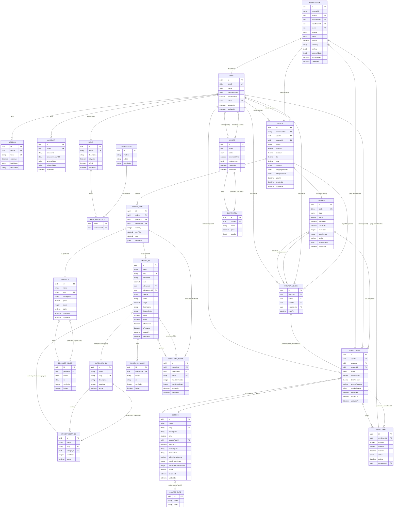

## Diagrama entidad-relación



---

## Dónde vive

- **Motor:** PostgreSQL >= 14.
- **Ubicación en producción:** <!-- RELLENAR: contenedor Dokploy / servicio externo, volumen, etc. -->
- **Conexión:** variable `DATABASE_URL` (ver [Variables](/mantener/variables/)).

## Migraciones (Drizzle)

El schema es la fuente de verdad. **Nunca** editar los `.sql` generados a mano.

```bash
# 1. Editar el schema del dominio en packages/database/src/<dominio>/schema.ts
# 2. Generar la migración
bun run db:generate
# 3. Aplicar
bun run db:push        # desarrollo
bun run db:migrate     # migraciones formales
```

`bun run db:studio` abre Drizzle Studio para inspeccionar datos.

## Backups

<!-- RELLENAR: política real de backups (frecuencia, retención, dónde se guardan) -->

Comando base para backup manual:

```bash
pg_dump "$DATABASE_URL" > backup-$(date +%Y%m%d-%H%M).sql
```

Restaurar:

```bash
psql "$DATABASE_URL" < backup-YYYYMMDD-HHMM.sql
```

:::caution[Obligatorio antes de la entrega]
Documentar la política real de backups aquí y **probar una restauración** al menos una vez. Un backup que nunca se restauró no es un backup.
:::
